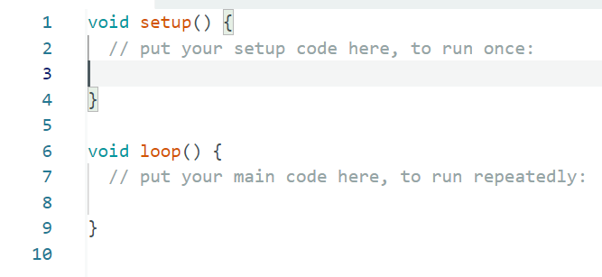
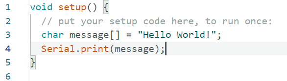
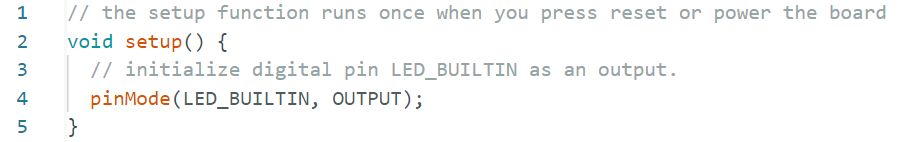
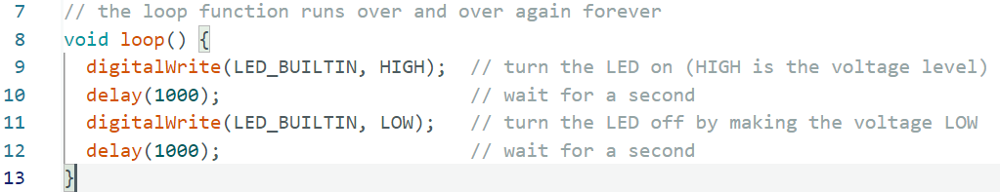
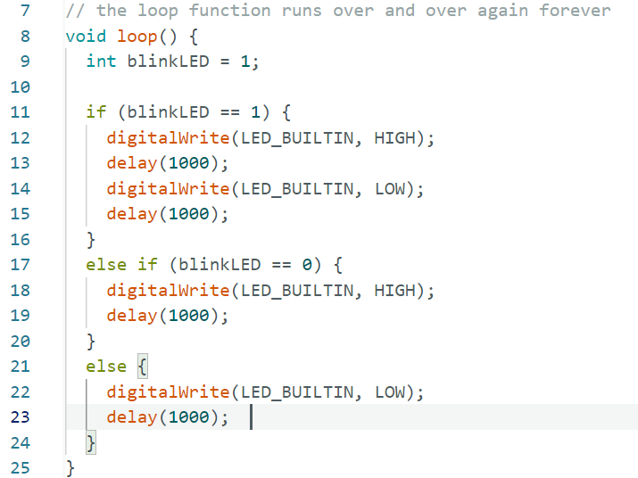

# Arduino Syntax Explained (Briefly)

While this file will use Arduino code for its examples, the principles here will apply to all programming languages.

## Table of Contents
- [Arduino Syntax Explained (Briefly)](#arduino-syntax-explained-briefly)
   * [Table of Contents](#table-of-contents)
   * [Intro - First Look](#intro-first-look)
      + [Blink Program - Pins and Delays](#blink-program-pins-and-delays)
- [C Syntax Summary](#c-syntax-summary)
   * [Variables](#variables)
      + [Variable Types](#variable-types)
      + [Declaring Variables ](#declaring-variables)
      + [Macros](#macros)
      + [Arrays](#arrays)
      + [Structs](#structs)
      + [Enums](#enums)
   * [Control Flow and Functions](#control-flow-and-functions)
      + [Conditional Statements](#conditional-statements)
      + [Functions](#functions)
    
## Intro - First Look

An arduino file is called a sketch, and starts out looking like this:



There are two functions here; `setup()` and `loop()`. The setup function is where the code begins and is *called* once. The loop function is called as frequently as possible (16MHz if there is no code inside slowing it down). More on functions later. 

the // creates a *comment*, comments are ignored and are used for documentation, improving readability or leaving notes for other programmers.

Lets write some code inside of `setup()`



`char` is the *type* of data stored in the *variable* I named `message`. `char` stands for character, but we are not storing a single character, we are storing an array of characters (this is called a *string*), so I put `[]` at the end of the variable name to indicate that this is an *array of characters*.

I then intialise this variable with the value *"Hello World!"*, which is then stored in SRAM. 

On the next line of code, once the variable `message` has been intitialised, I call the `print()` function  with the variable message as an *arguement* to the function at the `Serial` port. 

Arduinos have multiple Serial ports (`Serial1`, `Serial2`, etc) - the Serial without a number at the end refers to the USB Serial, so the connected laptop will recieve this message and output it in the output console when the code is uploaded. Remember that `setup()` is called first and as soon as the arduino is on.

### Blink Program - Pins and Delays

The Blink Program is the real hello world of embedded systems. You must: Initialise a pin (Where the LED is connected), send a signal to that pin, delay, send another signal, delay, repeat!

Luckily, Arduiono's have a built in LED you can use, the pin location is different for each board, but Arduino code has a macro that changes dependant on what board you have configured the IDE for, ensure it is set to whatever board you are using. 

The macro is called `LED_BUILTIN`, lets initialise this pin as an output pin inside the `setup()` function, since we only need to do it once. 



Here, we call the arduino function `pinMode`, and give it two arguements to set `LED_BUILTIN` pin to an output pin, for Arduino MEGA and most Arduino boards, this pin is D13 (Digital 13). This is all the setup we need.

Then we add some code inside the `loop()` function.



Semi-colons `;` are used to tell the complier that *"this is the end of this line of code"*. Each line of code is executed one at a time, from top to bottom. If we wanted we could write on line 9:
```
9   digitalWrite(LED_BUILTIN, HIGH); delay(1000);
```
Then remove the code on line 10. This would not change anything, since the semi-colon shows the end of that line of code. It is strongly recommended to avoid this for readability sake.

`digitalWrite()` allows us to write a high or low signal to a pin. We start by writing a high signal (5V, powering the LED) then after 1s, we write a low signal (0V, turning the LED off), then we wait another second. Once line 12 has exectuted, `loop()` is automatically called again and the process repeats.

This is embedded systems coding in a nutshell, you initalise a pin, send some signals to it, bosh!

# C Syntax Summary

Now that the IDE has been introduces and we are familiar with `setup()` and `loop()`, lets go over some baisc syntax. Every programming language has the same ideas we are about to go over, but they may be written differently.

## Variables

### Variable Types

* `char` - ASCII character. 1 byte. 
* `int` - Integer number. 4 bytes (usually), depends on operating system. 
* `float` - Decimal number. 4 bytes. Uses floating point representation.
* `double` - More precise decimal number. 8 bytes.
* `bool` True (1) or False (0). 1 byte. (New in C23)

In C, the smallest possible data type is 8 bits, that is why the `bool` is still 8 bits (1 byte). Despite the fact it would function with just 1 bit. 

**Integer Types**

`int` can be used quickly, but for better and cross platform memory control, use the following integer types:
* `int64_t` - 64 bits (8 bytes, -9X10^18 ... 9X10^18)
* `int32_t` - 32 bits (4 bytes, -2.1X10^9 ... 2.1X10^9)
* `int16_t` - 16 bits (2 bytes, -32,768 .. 32,767)
* `int8_t` - 8 bits (1 byte, -128 .. 127)

Then there is the unsigned variations, where the MSB (Most significant bit) is no longer used to represent if the int is negative.

* `uint64_t` - 64 bits (8 bytes, 0 ... 18X10^18)
* `uint32_t` - 32 bits (4 bytes, 0 ... 4.3X10^9)
* `uint16_t` - 16 bits (2 bytes, 0 ... 65,535)
* `uint8_t` - 8 bits (1 byte, 0 ... 255)

You can also use `signed`, `unsigned`, `long`, `long long` and `short` keywords which can be applied to all data types. [More here.](https://en.wikipedia.org/wiki/C_data_types)

### Declaring Variables 

When you declare a variable. You start with the data type, then the name, then what it is equal to. It is recommended to *initalise* it right away, however you can *assign* it later.

```C
1   int count = 0;    // Preferred
```
```C
1   int count;
... // other code
8   count = 0;      
9   // Good for certain cases
```

You can declare multiple variables of the same type in oe line too.

```C
float x = 1, y = 2, z = 3;
```

### Macros

Macros are useful for improving readability in C. *They are not variables* as they do not change thoughout runtime, they are only relevant to the [preprocessor stage of compilation]

```C
#define BUZZER_PIN D10
```
Before compliing the code, the preprocessor will replace every instance of `BUZZER_PIN` with the pin location `D10`. The macro from the earlier example `LED_BUILTIN` functions like this too. 
```C
#define DEBUG true
#define DEBUG_SERIAL if(DEBUG) Serial2
```
Here we make a macro for `DEBUG`, so every instance of this is replaced with `true`. Then another macro for `DEBUG_SERIAL`, so every instance of this is replaced with the code `if(DEBUG) Serial`. 

```C
DEBUG_SERIAL.print("Hello world!")
```
This will only run if `DEBUG` is `true`, the preprocessor will detect if `DEBUG` is `false` and remove the line entirely before the code is compiled. This means the final build will be faster as we can set this to `false` and there will be no debug code. 

Learn more about macros [here](https://www.programiz.com/c-programming/c-preprocessor-macros).

### Arrays

When declaring an array of a data type, you either specify the size of the array or assign each element a value.

```C
1   float prices[] = {1.5, 2.3, 8.7, 16.5};
```
```C
1   float prices[4]; // To be assigned later.
2   prices[0] = 1.5;
3   prices[1] = 2.3;
4   prices[2] = 8.7;
5   prices[3] = 16.5;
```

As we can see, the elements of an array are indexed from 0, so to access the first element we write `prices[0]`.

**Character Arrays**

Character arrays behave slightly differently, other languages make character arrays easier to work with by using a `string` data type. But in C, unless we use a library, we do not have that luxury. Here are the different ways of intialising/ assigning to a character array.

```C
1   char helloMessage[] = {'H', 'e', 'l', 'l', 'o', '\0'}  
```
```C
1   char helloMessage[] = "Hello";
```
```C
1   char helloMessage[5];
2   helloMessage = "Hello"; // Not possible in C, 
3   // need to set each character seperately
```
Let's focus on the first two examples. The first example is similiar to how an array is usualy initialised, notice how for each character we use single quotes `''`. At the end, we then need to add the null terminator `\0` (an escape character used to show the end of the string, without it, the program will try to read memory past where the character array is stored).

In the first example, we simply use double quotes `""`, this symbolises a *string literal*, which automatically places the null terminator `\0` at the end for us. 

That is all we will cover for character arrays/ strings for now in C. In order to go into why the 3rd example fails, we must introduce pointers, which will be introduced later.

### Structs

Structs are great for keeping related data closer together. 

```C
1   struct Vec3 {
2     int x, y, z;
3   };
4   struct Vec3 startPos = {1, 3, 2};
5   struct Vec3 endPos = {19, 30, 1};
6   struct Vec3 direction = { endPos.x-startPos.x, endPos.y-startPos.y, endPos.z-startPos.z };
```
We define a struct starting with the `struct` keyword, then the name of the struct. The data held by the struct is defined within the curly braces `{}`, these are the struct *members*. Think of this as the *structure* for a data type called Vec3 that we have made ourselves. 

We can then use this structure in our variables, and just like arrays, we use curly braces `{}` to intialise each struct member (in the order they are defined). We can use this structure as much as we like. 

A better way to define a struct is to use the keyword `typedef` which means type definition. 

```C
1   typedef struct {
2     int x, y, z;
3   } Vec3;
4   Vec3 startPos = {1, 3, 2};
5   Vec3 endPos = {19, 30, 1};
6   Vec3 direction = { endPos.x-startPos.x, endPos.y-startPos.y, endPos.z-startPos.z };
```
This makes Vec3 look like just another data type, and saves us from having to write struct. To learn more about struct, [click here](https://www.w3schools.com/c/c_structs.php). To learn more about typedef, [click here](https://www.geeksforgeeks.org/c/typedef-in-c/).

### Enums

Enums stands for enumerations, it is essentially a list where each element has a value, enums are used to make code more readable and control state.

```C
1   enum State { DISCONNECTED, RC_CONTROLLED, AUTONOMOUS  };
2   enum State state = AUTONOMOUS;
```
Similiar to a struct, we first define the enumerated list, each element actually represents an integer number - this defaults to 0, 1, 2, etc. The elements of an `enum` are just constants. Let's change what each element represents in this example:

```C
1   enum Speed { SLOW = 50, FAST = 100, SUPERFAST = 200};
2   enum Speed currentSpeed = 0;
```
`enum Speed currentSpeed = 0` is equivalent to `enum Speed currentSpeed = SLOW`, so `currentSpeed` will hold the value 50. 

Note: You can assign an `int` to one of the enum constants like so: `int currentSpeed = FAST;`

This will give `currentSpeed` the value of 50. The only downside to using an `int` over an `enum` type is that you cannot assign an index of the `enum` to the `int` type. E.g. you cannot write `int currentSpeed = 1` and expect to get the value of `FAST` assigned to it. 

Learn more about [enums here](https://www.w3schools.com/c/c_enums.php) and [type safety here](https://stackoverflow.com/questions/260626/what-is-type-safe).

## Control Flow and Functions

Control flow refers to the order in which intructions are exectuted.

### Conditional Statements



Once `blinkLED` is initialised, an `if` statement checks the *condition* that `blinkLED == 1`, note that it is important to use two equals signs to tell the compiler that this is not an assignment. The condition is written inside brackets `()`, the code to be executed when the condition is true is wrtten inside the curly braces `{}`. If the condition here is true, the LED will blink.

An `else if` statement is then carried out only if all other conditional statements before it were false. We can see from the code that if `blinkLED == 0` is true, we will keep the light on, no blinking.

Finally, if the other `if` and `else if` conditions are false, we will always carry out the `else` statements code. In this case, we turn the LED off. 

To learn more about conditionals and switch statements, [click here](https://www.w3schools.com/c/c_conditions.php).

### Functions

Let's write a function to control the LED.

```Arduino
enum LightState {BLINKING, ON, OFF};

// Runs over and over again
void loop() {
  enum LightState LEDState = ON; 
  controlLED(LEDState);
}

// Dictates the behaviour of the LED depending on the state.
void controlLED(enum LightState LED) {
    switch (LED) {
    case BLINKING:   
        digitalWrite(LED_BUILTIN, LOW);
        delay(1000);
        // fallthrough intended
    case ON:     
        digitalWrite(LED_BUILTIN, HIGH);
        delay(1000);
        break;
    default:    
        digitalWrite(LED_BUILTIN, LOW);
        delay(1000);
    }
}
```

`void` is the return type of the function, our function does not return any value, so we use `void`, otherwise you may use a data type like `int` or `char`.

We then name the function `controlLED`, and then inside the braces `()`, we define the function *parameters*, in this case `enum LightState LED`. The function code is then written inside the curly braces `{}`.

Inside `loop()`, we call our function `controlLED()` and pass in `LEDState` as an *arguement to the function*, this gives the function parameter `LED` the value of `LEDState`. Notice how the function parameter `LED` and the function arguement `LEDState` can have different names. The key idea is that the parameter takes the *value* of the arguement that was passed in. 

Notice how in the switch statement, in the code block that is executed when `LED == BLINKING`, there is no `break` statement. This means that the code in the next case block will execute until it hits a `break` is found, so we effectively get the blinking behaviour with less code. The performance difference is negligible, but I still wanted to show that this was possible. Code readability and maintainabilty always comes first. 

The main benefits of writing a function like this, is that it tidies the `loop()` function up significantly. Functions can also be called as many times as you want, making code *reusable*.

To learn more about functions and variable scope, [click here](https://www.w3schools.com/c/c_functions.php).


