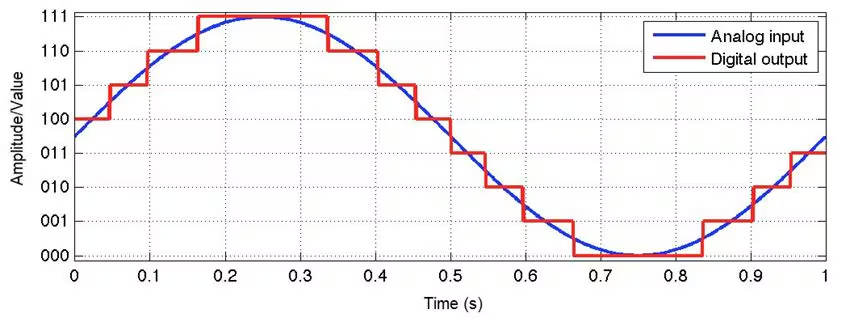

# Microcontroller Control

Microcontroller: Arduino Mega 2560.

### The main function of the Arduino is to:
1. Control motors, instructions recieved from JETSON or interpreted from RC.
2. Display traffic light messages.
3. Send telemetry data.
4. Process killswitch and multifunction buttons (On outside of main hull).
5. Control relays (turn certain systems on or off by changing a switch).
6. Process sensor data. Send it to JETSON.

### Setting up the Arduino:

1. Write code within the Arduino IDE (Integrated development environment).
2. Plug a USB in to the arduino and connect to your laptop COM port. Press Verify to ensure the code will build, then press Upload.
3. Hook up the pins/ peripherals in the right place based on your code.
4. Bosh. Hope and pray it works.

## Understanding the Arduino

### Arduino Code

The Arduino library is based on the programming language C, a low level language, allowing for greater memory control and runs fast - perfect for embedded development where memory is limited. Arduino code is easy to write in and easy to set up for your chosen Arduino board. It handles alot of the set-up that would need to be done with a custom or less beginner friendly microcontroller.

### Arduino Architecture

The Arduino Mega is very slow, it has a clock speed of 16MHz and only has one single threaded core. The clock speed measures the number of instructions it can execute per second, and the number of threads measures the number of instructions it can execute in parallel. 

This all means that the Arduino can only do one instruction at a time at a slow speed. 

Another disadvantage of the Arduino is that there are no built in sensors - it is a pure microcontroller, not a flight computer after all - a flight computer would have sensors built onto the board, allowing for more compact electronics and greater controller over the sensor data. 

As well as this, the Arduino has a bit resolution of 10 bits, meaning that data read from analogue inputs (continuous waves) are digitized, this causes a loss of precision in the analogue data, as it can only be represented using 10 bits. 

To combat this for voltage/ current measurements, an external sensor with a higher bit resolution is used, this then sends the actual numbers to the arduino through a digital port. This avoids the ADC (Analogue-to-Digital-Conversion) through the Arduino.

The Arduino Mega uses the AVR architecure, specifically designed for embedded systems. This means that the memory is all on the chip, there are three types of memory on an Arduino.

1. Flash - Stores large documents and the code.
2. EEPROM - (Electrically Erasable Programmable Read-Only Memory), can be used to store configuration data. 
3. SRAM - (Static Random Access Memory), temporary storage but very fast read and write speeds (used while arduino is running). 

## The Code

Before proceding with this section, it is recommended that you read the other document on the Arduino Code syntax. You will learn about basic coding skills aswell. 

